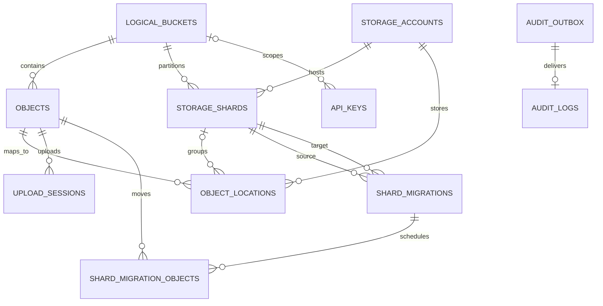

# D1 数据模型

初始 schema 位于 `database/migrations/0001_initial.sql`。D1 是逻辑命名空间与物理位置的权威
地图，Provider 的 LIST 结果不是系统真相。

## 核心关系



## 关键不变量

- `(logical_bucket_id, logical_key)` 唯一，保持统一命名空间稳定。
- 一个逻辑 Bucket 同时最多一个 `ACTIVE` shard。
- 一个对象同时最多一个 primary location；未来副本使用 non-primary location。
- `0006` 后每个 object 最多一个 `is_current = 1` upload session；重试前的 session/location 保留。
  session `location_id` 绑定该次上传的物理位置，清理历史尝试不能使用当前 primary。
- 一个源 shard 同时最多一个 `RUNNING` migration；每个 migration/object 最多一个任务。
- migration target reservation 创建 non-primary location，并同时增加目标 shard/account 用量；只有
  primary 切换且源 Provider 清理成功后才释放源计数。
- storage account 使用状态机，不物理删除历史引用中的账号。
- `credential_envelope` 只保存版本化加密信封，永不保存明文 secret。
- `key_hash`、`token_hash` 只保存不可逆摘要，明文只在创建时返回一次。
- 全部现有业务写入与对应 audit outbox append 同一 D1 batch/事务；outbox `id` 是全局唯一 event id。
- `PENDING`/`PROCESSING` 事件由租约保护，成功投递后为 `DELIVERED`；失败按退避重试。查询 union 未
  delivered outbox 与 `AUDIT_LOGS`，投递前后沿用同一公开 `id`。

## 状态机

Storage account：

```text
VERIFYING → ACTIVE → DRAINING → READ_ONLY → REMOVED
```

Object：

```text
PENDING → READY → DELETING → DELETED
```

Upload session：

```text
PENDING → COMPLETED
        → EXPIRED
        → ABORTED
```

Shard migration 与对象任务：

```text
RUNNING → COMPLETED | FAILED

RESERVED → SWITCHED → COMPLETED
        └→ FAILED → RESERVED
```

`MIGRATING` shard 状态只能由 durable migration 条件事务进入；通用 shard status API 不能绕过
migration 任务。`SWITCHED` 表示目标已经是 primary，但源清理仍可由原搬运器或 scheduled
maintenance 幂等重试。

Audit outbox：`PENDING → PROCESSING → DELIVERED`；失败回到可重试状态，租约过期可接管。同一
`event_id` 最多产生一条 delivered audit log。当前覆盖认证 session、API Key create/revoke、
Storage Account、Logical Bucket、Storage Shard、Object 与 Shard Migration 的全部现有 mutation。

状态转换必须由用例显式完成，并写 audit log。数据库 CHECK 约束只负责拒绝非法值。

上传重试不复活终态 session：PENDING object 保持原 ID/key，旧 current session 经条件事务替换为
全新的 PENDING session；旧 session 仅沿 EXPIRED → ABORTED 收敛。替换前先以旧 object size/primary
释放容量，再更新本次元数据并创建新预留。见 [ADR 0005](decisions/0005-upload-attempt-retries.md)。

## 迁移规则

迁移文件一旦用于任何共享或远端数据库就不可修改。新增 `NNNN_description.sql`，本地先运行
`npm run db:migrate:local`，再用测试覆盖读取和写入路径。
