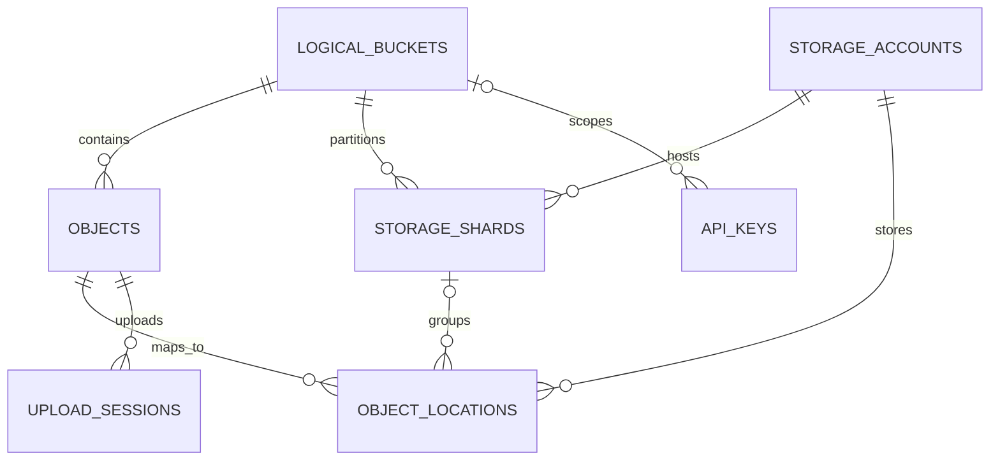

# D1 数据模型

初始 schema 位于 `database/migrations/0001_initial.sql`。D1 是逻辑命名空间与物理位置的权威
地图，Provider 的 LIST 结果不是系统真相。

## 核心关系



## 关键不变量

- `(logical_bucket_id, logical_key)` 唯一，保持统一命名空间稳定。
- 一个逻辑 Bucket 同时最多一个 `ACTIVE` shard。
- 一个对象同时最多一个 primary location；未来副本使用 non-primary location。
- storage account 使用状态机，不物理删除历史引用中的账号。
- `credential_envelope` 只保存版本化加密信封，永不保存明文 secret。
- `key_hash`、`token_hash` 只保存不可逆摘要，明文只在创建时返回一次。

## 状态机

Storage account：

```text
VERIFYING → ACTIVE → DRAINING → READ_ONLY → REMOVED
```

Object：

```text
PENDING → READY → DELETING → DELETED
```

Upload session：

```text
PENDING → COMPLETED
        → EXPIRED
        → ABORTED
```

状态转换必须由用例显式完成，并写 audit log。数据库 CHECK 约束只负责拒绝非法值。

## 迁移规则

迁移文件一旦用于任何共享或远端数据库就不可修改。新增 `NNNN_description.sql`，本地先运行
`npm run db:migrate:local`，再用测试覆盖读取和写入路径。
