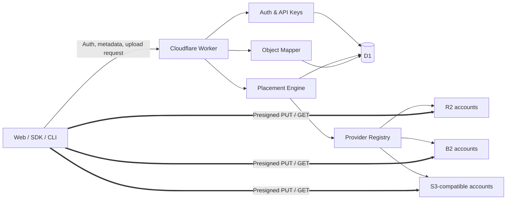
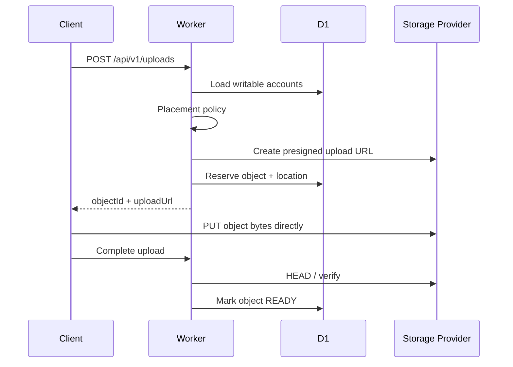

# 架构总览

OpenPool 是对象存储控制面，不是对象数据代理。它维护逻辑命名空间、凭证、容量、健康状态、
放置策略和对象位置；实际对象内容由客户端和底层 Provider 直接传输。



## 上传时序



生产实现必须处理签名成功但预留失败、客户端未完成上传、重复 complete 等情况。上传会话因此是
显式状态机，而不是一次数据库写入。

## 代码层次

```text
apps/worker/adapters   HTTP、D1、加密、Provider SDK 适配器
apps/worker/composition 依赖装配；平台对象只能在这里进入用例
packages/application  用例和由用例定义的端口
packages/domain       实体、值对象、状态和纯策略
```

依赖只能向内。Web 只依赖共享 API 契约，不直接依赖领域或 Worker 实现。

## V1 Placement

初始策略只考虑：账号必须 `ACTIVE` 且允许写入；写入后不得超过 90% soft limit；高优先级
优先，同优先级选择剩余空间更多的账号。复杂成本、延迟、权重和一致性哈希待真实数据证明需要后
再引入。
